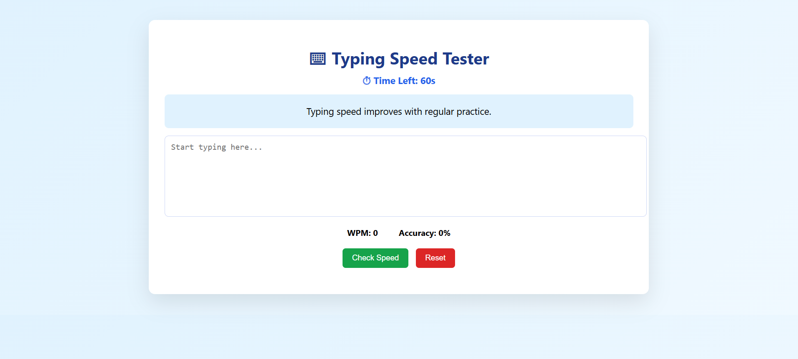
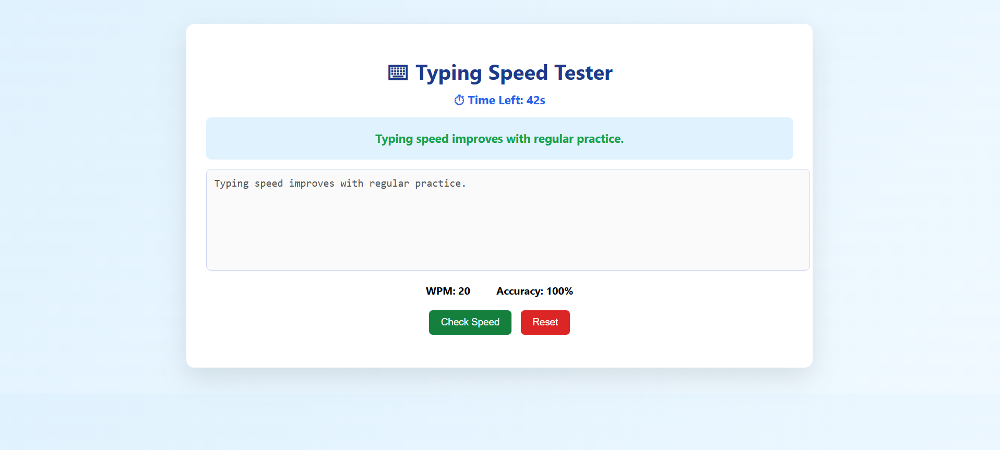

# ⌨️ Typing Speed Tester (Web App)

A web-based **Typing Speed Tester** that measures **Words Per Minute (WPM)** and **accuracy** in real time.  
The application features a **live countdown timer**, **error detection & highlighting**, and robust **fault handling** — making it a solid technical mini project.


## 🚀 Live Demo
🔗(https://typing-speed-tester-otgg.onrender.com)


## 🧠 Features

- ⏱️ **Live Countdown Timer**
  - Timer starts automatically when the user begins typing
  - Stops when time ends or when *Check Speed* is clicked

- 🎯 **Real-Time Error Detection**
  - Correct characters highlighted in **green**
  - Incorrect characters highlighted in **red**
  - Remaining text shown normally

- 📊 **Performance Metrics**
  - Words Per Minute (WPM)
  - Typing Accuracy (%)

- 🛑 **Fault Handling & Edge Cases**
  - Prevents checking speed without typing
  - Disables input when timer ends
  - Prevents copy–paste cheating
  - Handles division-by-zero safely

- 🌐 **Web-Based & Deployable**
  - Runs entirely in the browser
  - Easy to host live using cloud platforms


## 🛠️ Tech Stack

- **Backend**: Flask (Python)
- **Frontend**: HTML, CSS, JavaScript
- **Logic**: Client-side JavaScript (real-time processing)
- **Deployment**: Render


## 📂 Project Structure

```text
typing-speed-tester/
│
├── app.py                # Flask application entry point
├── requirements.txt      # Project dependencies
├── README.md             # Project documentation
│
├── templates/            # HTML templates
│   └── index.html
│
├── static/               # Static files
│   ├── style.css         # Styling
│   └── script.js         # Client-side logic
│
├── assets/               # Screenshots & media
│   └── preview.
```


## 🧪 How It Works

1. A random sentence is displayed on the screen
2. Timer starts when the user presses the first key
3. Each typed character is compared in real time
4. Errors are highlighted instantly
5. When time ends or *Check Speed* is clicked:
   - WPM is calculated
   - Accuracy percentage is displayed


## 🖥️ Screenshots






## 🧩 Fault Handling Implemented

- Empty input detection
- Timer expiration handling
- Paste & copy prevention
- Safe accuracy calculation
- Input disabling after test completion


## 📄 License

This project is licensed under the **MIT License** — free to use, modify, and distribute.


## ⭐ Like this project?

If you found this helpful or interesting, consider giving it a ⭐ on GitHub — it really helps!
